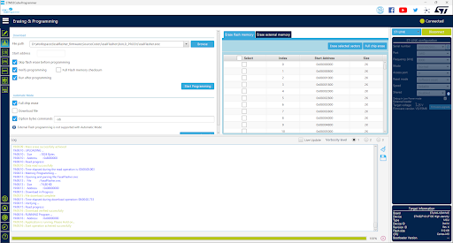
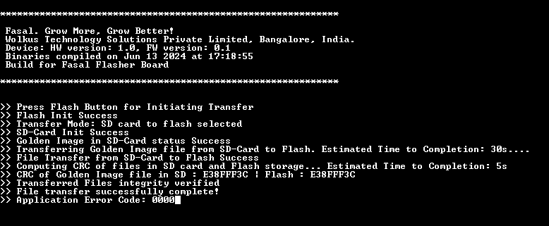
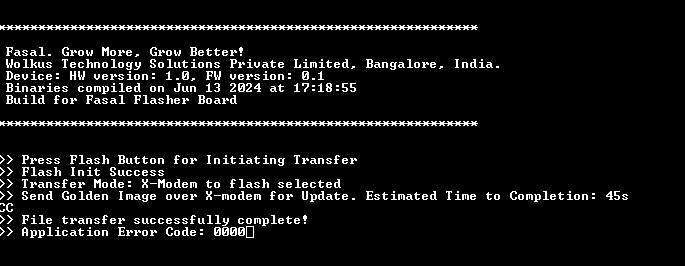

# 🚀 FileFerry-Click2Flash Demonstration

This document demonstrates how FileFerry-click2Flash can be used for your project!

## Table of contents

- [Release_Contents_overview](#release-contents-overview)
- [Setup](#setup)
- [Usage_Instructions](#usage-instructions)
- [DiagnosticsInformation](#diagnostics-information)
- [Build-Instruction](#build-instruction)
- [Documentation](#docs)
- [Contact-Me](#contact-me)

## Context

## Release Contents overview

The prebuilt binaries released are available under the release folder @ref /Firmware/Releases is comprised of

1. APP: Application Binaries
    1. BUILD_DEBUG: Debug Build with all debug symbols and messages enabled for debugging purposes
    2. BUILD_PROD:  Production build optimized for performance. Meant for use on the production floor
2. FasalFlasher_ReleaseNote.pdf: Release Note with details about the build and usage
3. ReadMe.txt: Instructional text document that captures essential Release information

## Setup

The following steps are to be followed with a new FileFerry-Click2Flash device

### Software and tools used

1. [ST Cube Programmer](https://www.st.com/en/development-tools/stm32cubeprog.html) : To upload binaries to device
2. [TeraTerm](https://teratermproject.github.io/index-en.html) : Or equivalent serial monitor tool with XModem protocol

### External device (Target) setup

1. The external device (Target) needs to be empty prior to usage with Fasal Flasher. If a program is running on it, it will interfere with the flashing operation.
2. You can put the device in "suspend" mode. (Example: Use BOOT0 if the target has a STM32 MCU to halt program execution).
3. Alternately, erase the MCU's (or MPU's) internal Flash program.

### FileFerry-Click2Flash device SD-Card SetUp

1. The precompiled binary of the FileFerry-Click2Flash expects a file name "Fallback.txt" in the SD Card to be present. This "Fallback.txt" gets transferred to the Target SPI Flash.
2. Note: ".txt" is just a file format notation and not an actual text file. The file in the demo is a ".srec" compiled binary that can be used to perform DFU of a target STM32 MCU. The .srec compiled binary is renamed as "Fallback.txt".
3. Copy the file "Fallback.txt" into an SD-card and insert the same into the FileFerry-Click2Flash device. Please note that that any file that needs to be transferred must be named Fallback.txt for the file to be recognized by the FileFerry-Click2Flash.
4. You may change the file name expected by the FileFerry-Click2Flash, recompile the code and upload the new code to the FileFerry-Click2Flash device. You can then rename the SD card file accordingly.

### Burning the Application code to a fresh FileFerry-Click2Flash PCB

1. Insert the above SD card (with the "fallback.txt" file in it).
2. Connect a Type-C USB and slide the power switch to power on the device.
3. Connect a STLink V3 minie on the programming header.
4. Open the STM32cube Programmer.
5. First, erase the complete device using Full chip erase option under Erasing and programming section in the side-Menu
6. Select & load application file *App/PROD/FasalFlasher_Vx_y_PROD.srec* to device



## Using the FileFerry-Click2Flash device

1. Ensure that the device is powered over USB and the power switch is ON, and that the set up is complete as instructed in the application setup 
2. The operation mode can be selected as either SD-Card mode or XModem mode though the slide switch. The two modes are described below 
3. Ensure that the device whose Flash needs to be programmed is not running any application. Disconnect the power source for the external board and connect to the flash SPI interface using the Pogo interface
4. The application state will be indicated in accordance with []

### SD-Card Mode

1. A correctly set up device will wait for the User Flash button button  
2. Once the Button is pressed the device will initialize both the onboard SD-Card interface and the external flash.
3. The files will be copied, integrity will be checked and the status will be indicated
4. The file transfer status will be indicated over LED and the console



### XModem Mode

1. A correctly set up device will wait for the User Flash button button  
2. Once the Button is pressed the device will wait for the golden image file over the serial interface
3. Launch Serial USB terminal, select the appropriate com-port and use the following Serial settings 
    1. Baud Rate : 115200
    2. Data : 8 bit
    3. Speed : 115200
    4. Stop bits : 1 bit
    5. Flow control : none
4. The file transfer status will be indicated over LED and the console
5. XModem mode can be used either over PC though serial terminal programs like TeraTerm or cell phone over USB serial terminal.



## Diagnostics Information

### App State Indication

The application status is indicated by the On board TriColor LED during program execution. The application states, their meaning and corresponding indication state is documented below

| App State                     | Indication          |
| --------                      | -------             |
|eFASAL_APP_INIT                | eIND_BLUE_250MS     |
|eFASAL_APP_BUTTON_WAIT         | eIND_BLUE_500MS     |
|eFASAL_APP_SD_INIT             | eIND_BLUE_1000MS    |
|eFASAL_APP_SD_CHECK            | eIND_BLUE_1000MS    |
|eFASAL_APP_FLASH_INIT          | eIND_BLUE_1000MS    |
|eFASAL_APP_MODE_SELECTION      | eIND_BLUE_1000MS    |
|eFASAL_APP_SD_FLASH_TRANSFER   | eIND_YELLOW_1000MS  |
|eFASAL_APP_XMODEM_TRANSFER     | eIND_YELLOW_1000MS  |
|eFASAL_APP_CRC_COMPARE         | eIND_YELLOW_1000MS  |
|eFASAL_APP_TRANSFER_SUCCESS    | eIND_GREEN_0        |
|eFASAL_APP_SD_FAIL             | eIND_RED_250MS      |
|eFASAL_APP_SD_FILE_FAIL        | eIND_RED_250MS      |
|eFASAL_APP_TRANSFER_FAIL       | eIND_RED_250MS      |
|eFASAL_APP_CRC_FAIL            | eIND_RED_250MS      |
|eERR_ARM_FAULT                 | eIND_RED_250MS      |
|eFASAL_APP_END                 | eIND_RED_250MS      |
|eFASAL_MAX_STATE               | eIND_RED_250MS      |

### Error Codes

The application also supporters error codes to indicate specific error conditions. These are captured below along with the indication if present

| Error Code | Error                        |
| --------   | -------                      |
|0x0000      | eERR_NO_ERRORS               |
|0x0001      | eERR_SDCARD_NOT_FOUND        |
|0x0002      | eERR_SDCARD_FILE_NOT_FOUND   |
|0x0004      | eERR_FLASH_NOT_FOUND         |
|0x0008      | eERR_FLASH_TRANSFER_FAILURE  |
|0x0010      | eERR_CRC_FAILURE             |
|0x1000      | eERR_STM_HAL_FAILURE         |
|0x2000      | eERR_ARM_FAULT               |
|0x4000      | eERR_ASSERTION_FAILURE       |
|0x8000      | eERR_SLEEP_FAILURE           |

## Build-Instruction
If you want to modify the firmware functionality, you can re-build the code for the FileFerry-Click2Flash device using these steps:
1. Built using CubeIDE Version: 1.15.1 Build: 21094_20240412_1041 (UTC)
2. Both BUILD_DEBUG and BUILD_PROD Uses Linker script STM32f103RETX_FLASH.ld with flash offset of 0x0800 0000, application size set to 512KB
3. The following build configurations are built into the codebase
    1. *BUILD_DEBUG* : Debug build used during development with all debug symbols enabled
        - Optimization level : None
        - Symbols defined : DEBUG | STM32F103xE | USE_HAL_DRIVER

    2. *BUILD_PROD* : Production build for filed use
        - Optimization level : Ofast
        - Symbols defined : NDEBUG | STM32F103xE | USE_HAL_DRIVER
4. @ref SourceCode/FasalFlasher/User_Files/AppCommon/AppConfiguration for changing compile time build features

## Docs

1. Doxygen files are generated under @ref Docs/html by running the following command in the current folder ```doxygen Doxyfile```
2. The files can be viewed by opening Index.html in any browser. Files located here @ref Docs/html
3. Latex Generated PDF file is preset at @ref Docs/Design_Document/FasalFlasher_FirmwareDesignDocument.pdf

## Contact-Me

- <vishalbhatta@gmail.com> over E-Mail
- [Vishal Keshava Murthy](https://www.linkedin.com/in/vishal-keshava-murthy-8a2ba1a7/) over LinkedIn
