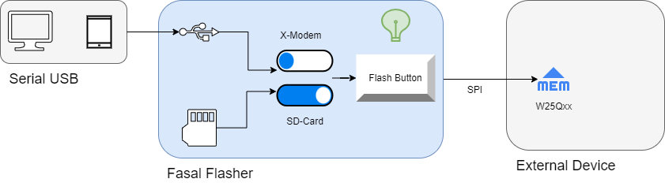
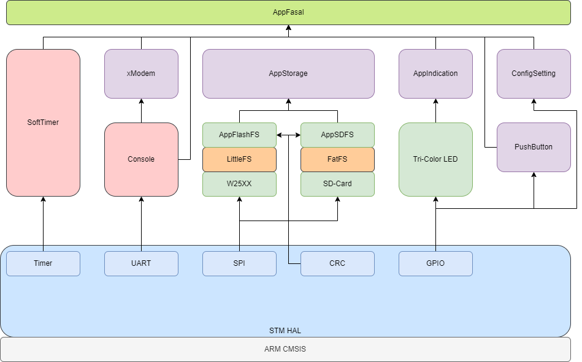
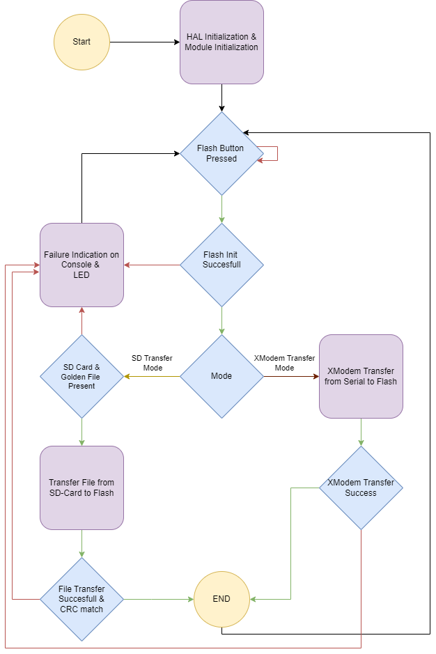

# Fasal Flasher {#mainpage}

This repository contains Fasal Flasher Source Code. Dive right into the codebase through @ref AppFasal_Run invoked in @ref main.c !

## Table of contents

- [Context](#context)
- [Project-structure](#project-structure)
- [Code-flow](#code-flow)
- [Build-Instruction](#build-instruction)
- [Documentation](#docs)
- [Contact-Me](#contact-me)

## Context

Fasal Flasher is an Internal tool meant as a production floor Aid. Its primary purpose is to update the contents flash IC
W25Qxx either with the contents of the Fasal Flasher onboard SD-Card or over a serial terminal over XModem protocol.
The device has the following salient features

1. Powered by USB either through PC, Mobile phone or any USB source
2. File Input from either Serial console through USB connector or SD-Card
3. Slide switch to select between file source of SD-Card and Serial console (X-modem)
4. The W25Qxx flash IC in external board is powered through the Fasal Flasher and programmed over SPI
5. PushButton to trigger the transfer in the configured Mode
6. Tri-Color LED for visual indication about the process result
7. Logs over the same USB cable with information about the running application
8. File Integrity check via CRC in case of SD-Card transfer mode
9. File Integrity check inbuilt via XModem protocol in case of XModem transfer mode



## Project-structure

1. The project is divided into the following folders
2. @ref SourceCode/FasalFlasher/Core : Contains CubeMX Generated Files utilizing the STM HAL. These files are mostly unmodified and used as is
3. @ref SourceCode/FasalFlasher/Drivers : STM HAL files
4. @ref SourceCode/FasalFlasher/FATFS : FatFS library
5. @ref SourceCode/FasalFlasher/Middlewares : Contains STM crypto library and FatFS library, used as is without any modifications
6. @ref SourceCode/FasalFlasher/User_Files : All custom code for the Fasal Application is present in this folder
    1. @ref SourceCode/FasalFlasher/User_Files/AppCommon : Contains modules used across the whole application, these include
        1. SourceCode/FasalFlasher/User_Files/AppCommon/AppConfiguration : Project version and compile time configuration constants
        2. SourceCode/FasalFlasher/User_Files/AppCommon/AppUtility : Utility functions common across all Fasal CodeBases
        3. SourceCode/FasalFlasher/User_Files/AppCommon/ConfigSetting : Module to check Board HW configuration
        4. SourceCode/FasalFlasher/User_Files/AppCommon/Console : Console for User logs and X-Modem
        5. SourceCode/FasalFlasher/User_Files/AppCommon/PushButton : PushButton module
        6. SourceCode/FasalFlasher/User_Files/AppCommon/TriColorLED : TriColor LED module
    2. @ref SourceCode/FasalFlasher/User_Files/AppFasal : Top level application code, Application entry point
    3. @ref SourceCode/FasalFlasher/User_Files/AppStorage : Top level storage module built atop Flash and SDcard file systems respectively
        1. @ref SourceCode/FasalFlasher/User_Files/AppStorage/AppFlashFS : Filesystem based on LittleFS file system built atop W25Qxx flash IC
        2. @ref SourceCode/FasalFlasher/User_Files/AppStorage/AppSDFS : Filesystem based on FatFS file system built atop SPI based SD-Card
    4. @ref SourceCode/FasalFlasher/User_Files/xModem : xModem module built on top of UART based console module



```text
+---BUILD_DEBUG
+---BUILD_PROD
+---Core
¦   +---Inc
¦   +---Src
¦   +---Startup
+---Drivers
¦   +---CMSIS
¦   ¦   +---Device
¦   ¦   ¦   +---ST
¦   ¦   ¦       +---STM32F1xx
¦   ¦   ¦           +---Include
¦   ¦   ¦           +---Source
¦   ¦   ¦               +---Templates
¦   ¦   +---Include
¦   +---STM32F1xx_HAL_Driver
¦       +---Inc
¦       ¦   +---Legacy
¦       +---Src
+---FATFS
¦   +---App
¦   +---Target
+---Middlewares
¦   +---Third_Party
¦       +---FatFs
¦           +---src
¦               +---option
+---User_Files
    +---AppCommon
    ¦   +---AppConfiguration
    ¦   +---AppUtility
    ¦   ¦   +---AppProfiler
    ¦   ¦   +---SoftTimer
    ¦   +---ConfigSetting
    ¦   +---Console
    ¦   +---PushButton
    ¦   +---TriColorLED
    +---AppFasal
    +---AppStorage
    ¦   +---AppFlashFS
    ¦   ¦   +---LittleFS
    ¦   ¦   +---W25Qxx
    ¦   +---AppSDFS
    +---xModem

```

## Code-flow

1. The code flow and the corresponding modules are documented in this section
2. The code starting point is @ref main. All HAL modules are initialized here along with Application level code housed in @ref AppFasal.h
3. @ref AppFasal_Init Initializes the application, sends startup message and sets up the TriColorLED, console and startup timer
4. The function @ref AppFasal_Run is the application state-machine that drives the application
    1. Module level initialization is carried out in the first step
    2. The application then waits for the user to press the flash user button
    3. External flash is then initialized before progressing to the file transfer phase
    4. Depending on the hardware slide switch setting, the device can then proceed in one of the following modes
        1. SD-Card Transfer Mode:
            1. SD-Card is initialized and it is ensured that the Golden image is present
            2. Golden image is transferred from the SD card to the external flash
            3. CRC of the same file in SD-Card and in the now transferred flash are computed and checked against each other
        2. XModem Transfer Mode:
            1. File Must be transferred over XModem 1K option though a serial terminal [Baud: 115200, Data: 8b, Stop Bit: 1b]
    5. In either mode, On successful reception of Golden Image, the Firmware then enters the termination stage, indicates success and waits on the flash user button stage
    6. In either mode failure of any of the steps prior to successful transfer results in the application state-machine indicating the failure reason and jumping back flash user button stage



## Build-Instruction

1. Built using CubeIDE Version: 1.15.1 Build: 21094_20240412_1041 (UTC)
2. Both BUILD_DEBUG and BUILD_PROD Uses Linker script STM32f103RETX_FLASH.ld with flash offset of 0x0800 0000, application size set to 512KB
3. The following build configurations are built into the codebase
    1. *BUILD_DEBUG* : Debug build used during development with all debug symbols enabled 
        - Optimization level : None
        - Symbols defined : DEBUG | STM32F103xE | USE_HAL_DRIVER

    2. *BUILD_PROD* : Production build for filed use
        - Optimization level : Ofast
        - Symbols defined : NDEBUG | STM32F103xE | USE_HAL_DRIVER
4. @ref SourceCode/FasalFlasher/User_Files/AppCommon/AppConfiguration for changing compile time build features

## Docs

1. Doxygen files are generated under @ref Docs/html by running the following command in the current folder ```doxygen Doxyfile```
2. The files can be viewed by opening Index.html in any browser. Files located here @ref Docs/html
3. Latex Generated PDF file is preset at @ref Docs/Design_Document/FasalFlasher_FirmwareDesignDocument.pdf

## Contact-Me

- <vishalbhatta@gmail.com> over E-Mail
- [Vishal Keshava Murthy](https://www.linkedin.com/in/vishal-keshava-murthy-8a2ba1a7/) over LinkedIn
